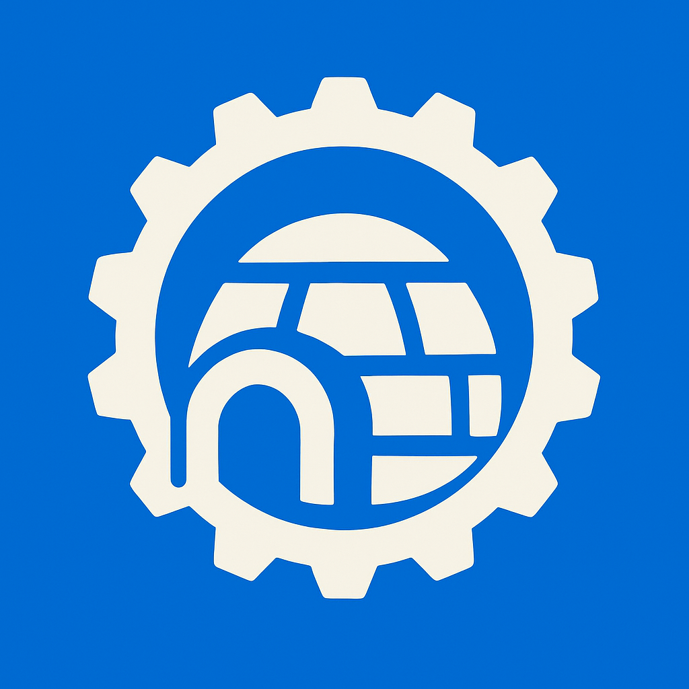

<p align="center">
    
</p>

# WASM-Test: WebAssembly GUI Plugin System

A proof-of-concept WebAssembly plugin system for GUI applications using Rust, Iced, and the WebAssembly Component Model.

## Overview

This project demonstrates how to build a modular GUI application where the UI components are loaded as WebAssembly plugins. The system uses:

- **Host Application**: An Iced-based GUI application that manages and renders WebAssembly plugins
- **Guest Plugins**: WebAssembly components that define UI elements and behavior
- **WIT (WebAssembly Interface Types)**: For type-safe communication between host and guest
- **Component Model**: For secure, sandboxed plugin execution

## Architecture

```
┌─────────────────┐    ┌──────────────────┐    ┌─────────────────┐
│  Host App       │    │  WIT Definitions │    │  Guest Plugin   │
│  (Iced)         │◄──►│  (Interface)     │◄──►│  (WASM)         │
│                 │    │                  │    │                 │
│ PluginManager   │    │ • Elements       │    │ • State         │
│ MessageManager  │    │ • Messages       │    │ • View Logic    │
│ Resource Tables │    │ • Components     │    │ • Event Handlers│
└─────────────────┘    └──────────────────┘    └─────────────────┘
```

## Project Structure

```
wasm-test/
├── crates/
│   ├── igloo/              # Host library for managing WASM plugins
│   │   ├── src/
│   │   │   ├── lib.rs
│   │   │   ├── plugin_manager.rs
│   │   │   └── widgets/    # Host-side widget implementations
│   │   └── Cargo.toml
│   └── igloo_guest/        # Guest library for creating WASM plugins
│       ├── src/
│       │   ├── lib.rs
│       │   ├── element.rs
│       │   └── widgets/    # Guest-side widget implementations
│       └── Cargo.toml
├── examples/
│   └── rust_host/          # Example host application
│       ├── guest/          # Example guest plugin
│       └── src/main.rs     # Main host application
├── wit/                    # WebAssembly Interface Type definitions
│   ├── world.wit          # Main interface definition
│   ├── shared.wit         # Shared types
│   ├── message.wit        # Message handling
│   └── *.wit             # UI component definitions
├── plugins/
│   └── js/                # JavaScript plugin support (experimental)
└── justfile               # Build automation
```

## Features

- **Type-Safe Plugin Communication**: Using WIT for interface definitions
- **Rich UI Components**: Support for buttons, text, containers, layouts, and more
- **Message Passing**: Bidirectional communication between host and plugins
- **Resource Management**: Efficient handling of UI elements across WASM boundary
- **Plugin Isolation**: Secure sandboxed execution of plugin code
- **Multi-Language Support**: Framework for supporting different plugin languages

## Getting Started

### Prerequisites

- Rust and rustup installed
- [mise](https://mise.jdx.dev/) installed 

### Setup

1. Clone the repository:
```bash
git clone <repository-url>
cd igloo
```

2. Install required Rust target:
```bash
just setup
# or manually:
rustup target add wasm32-wasip2
```

3. Build and run the example:
```bash
just run
```

### Creating a Plugin

1. Create a new Rust library with `crate-type = ["cdylib"]`
2. Add `igloo_guest` as a dependency
3. Implement the required traits:

```rust
use igloo_guest::*;

#[derive(Debug, Clone)]
pub enum MyMessage {
    ButtonPressed,
    // ... other messages
}

pub struct MyPlugin {
    counter: u32,
}

impl MyPlugin {
    pub fn new() -> Self {
        Self { counter: 0 }
    }

    pub fn update(&mut self, message: MyMessage) {
        match message {
            MyMessage::ButtonPressed => {
                self.counter += 1;
            }
        }
    }

    pub fn view(&self) -> Element {
        column![
            text!("Count: {}", self.counter),
            button("Click me").on_press(MyMessage::ButtonPressed)
        ].into()
    }
}

impl igloo_guest::Application<MyPlugin, MyMessage> for MyPlugin {
    fn new() -> Self
    where
        Self: Sized,
    {
        MyPlugin::new()
    }

    fn view(&self) -> Element<MyMessage> {
        self.view()
    }

    fn update(&mut self, message: MyMessage) {
        self.update(message);
    }
}
// Export the plugin
igloo_guest::export_guest!(MyPlugin, MyMessage);
```

4. Compile to WASM:
```bash
cargo build --target wasm32-wasip2 --release
```

### Loading Plugins in Host

```rust
use igloo::plugin_manager::PluginManager;

let mut plugin_manager = PluginManager::new()?;
plugin_manager.add_plugin_from_file("my-plugin", "path/to/plugin.wasm")?;

// In your update loop:
plugin_manager.plugin_update("my-plugin", message)?;

// In your view:
let plugin_view = plugin_manager.plugin_view("my-plugin")?;
```

## Development

### Building

- Build all components: `cargo build`
- Build for WASM target: `cargo build --target wasm32-wasip2`
- Run example: `just run`
- Generate bindings: `just gen`

## Acknowledgments

- [Iced](https://github.com/iced-rs/iced) - GUI framework
- [Wasmtime](https://github.com/bytecodealliance/wasmtime) - WebAssembly runtime
- [wit-bindgen](https://github.com/bytecodealliance/wit-bindgen) - Interface generation
- WebAssembly Component Model specification

## License

Licensed under either of

 * Apache License, Version 2.0, ([LICENSE-APACHE](LICENSE-APACHE) or http://www.apache.org/licenses/LICENSE-2.0)
 * MIT license ([LICENSE-MIT](LICENSE-MIT) or http://opensource.org/licenses/MIT)

at your option.

### Contribution

Unless you explicitly state otherwise, any contribution intentionally
submitted for inclusion in the work by you, as defined in the Apache-2.0
license, shall be dual licensed as above, without any additional terms or
conditions.