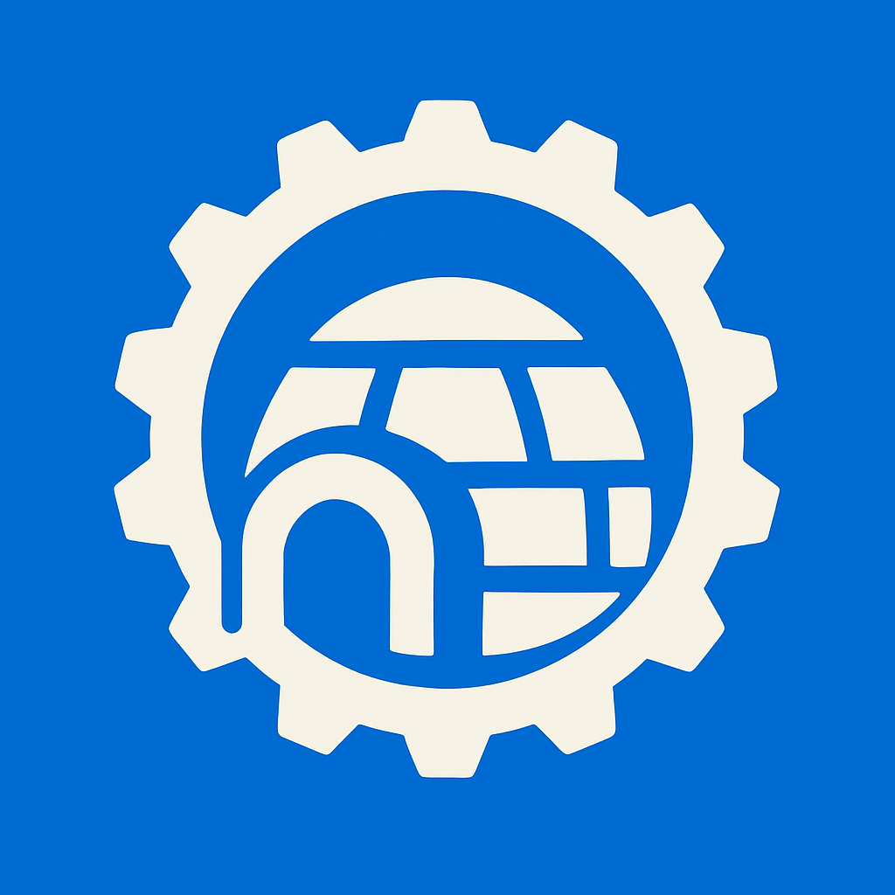

<p align="center">
    
</p>


# Igloo: WebAssembly Plugin System for Iced

Igloo is a modular plugin system for GUI applications, built with Rust, Iced, and the WebAssembly Component Model. It enables dynamic loading of UI components as secure, sandboxed WebAssembly plugins, making it easy to extend and customize desktop applications.

## Overview


Igloo lets you:
- Build desktop GUIs with plugins written in Rust or other WASM-compatible languages
- Use WIT (WebAssembly Interface Types) for type-safe host/guest communication
- Run plugins in a secure, isolated environment

- **Host Application**: An Iced-based GUI application that manages and renders WebAssembly plugins
- **Guest Plugins**: WebAssembly components that define UI elements and behavior
- **WIT (WebAssembly Interface Types)**: For type-safe communication between host and guest
- **Component Model**: For secure, sandboxed plugin execution

## Features

- **Type-Safe Plugin Communication**: WIT-based interfaces for host/guest messaging
- **Rich UI Components**: Buttons, text, containers, layouts, and more
- **Message Passing**: Bidirectional communication between host and plugins
- **Resource Management**: Efficient handling of UI elements across WASM boundary
- **Plugin Isolation**: Secure sandboxed execution of plugin code
- **Multi-Language Support**: Rust, JavaScript (experimental), and more

## Todo
- Add iced canvas support
- Add cwasm plugin support and precompilation guide
- Auto cache plugins by compling then storing compiled version and useing hash to check for changes
- Figure out how to hook in iced tasks and subscriptions for async operations

## Getting Started

### Prerequisites

- Rust and rustup installed
- [mise](https://mise.jdx.dev/) installed 


### Setup

1. Clone the repository:
```bash
git clone https://github.com/n1ght-hunter/igloo.git
cd igloo
```

2. Install required Rust target:
```bash
just setup
# or manually:
rustup target add wasm32-wasip2
mise install
```

2.5 (Optional) Build js plugin:
```bash
just build-js
```

3. Build and run the example:
```bash
just run
```

### Creating a Plugin

1. Create a new Rust library with `crate-type = ["cdylib"]`
2. Add `igloo_guest` as a dependency
3. Implement the required traits:

```rust
use igloo_guest::*;

#[derive(Debug, Clone)]
pub enum MyMessage {
    ButtonPressed,
    // ... other messages
}

pub struct MyPlugin {
    counter: u32,
}

impl MyPlugin {
    pub fn new() -> Self {
        Self { counter: 0 }
    }

    pub fn update(&mut self, message: MyMessage) {
        match message {
            MyMessage::ButtonPressed => {
                self.counter += 1;
            }
        }
    }

    pub fn view(&self) -> Element {
        column![
            text!("Count: {}", self.counter),
            button("Click me").on_press(MyMessage::ButtonPressed)
        ].into()
    }
}

impl igloo_guest::Application<MyPlugin, MyMessage> for MyPlugin {
    fn new() -> Self
    where
        Self: Sized,
    {
        MyPlugin::new()
    }

    fn view(&self) -> Element<MyMessage> {
        self.view()
    }

    fn update(&mut self, message: MyMessage) {
        self.update(message);
    }
}
// Export the plugin
igloo_guest::export_guest!(MyPlugin, MyMessage);
```


4. Compile to WASM:
```bash
cargo build --target wasm32-wasip2 --release
```


### Loading Plugins in Host

```rust
use test_host::plugin_manager::PluginManager;

let mut plugin_manager = PluginManager::new()?;
plugin_manager.add_plugin_from_file("my-plugin", "path/to/plugin.wasm")?;

// In your update loop:
plugin_manager.plugin_update("my-plugin", message)?;

// In your view:
let plugin_view = plugin_manager.plugin_view("my-plugin")?;
```

## Development

### Building

- Build all components: `cargo build`
- Build for WASM target: `cargo build --target wasm32-wasip2`
- Run example: `just run`
- Generate bindings: `just gen`

Warning: Loading plugins can be slow during development due to Wasmtime compilation. 
Consider adding this to your `Cargo.toml` for faster builds or running in release mode:

```toml
# Optimize wasmtime/cranelift in dev builds for faster WASM compilation
[profile.dev.package.wasmtime]
opt-level = 3

[profile.dev.package.cranelift-codegen]
opt-level = 3

[profile.dev.package.regalloc2]
opt-level = 3
```
or precompile your plugins using `wasmtime compile` like so:
```bash
wasmtime compile --target wasm32-wasip2 path/to/plugin.wasm -o path/to/plugin.cwasm
```

## Acknowledgments

- [Iced](https://github.com/iced-rs/iced) - GUI framework
- [Wasmtime](https://github.com/bytecodealliance/wasmtime) - WebAssembly runtime
- [wit-bindgen](https://github.com/bytecodealliance/wit-bindgen) - Interface generation
- WebAssembly Component Model specification

## License

Licensed under either of

 * Apache License, Version 2.0, ([LICENSE-APACHE](LICENSE-APACHE) or http://www.apache.org/licenses/LICENSE-2.0)
 * MIT license ([LICENSE-MIT](LICENSE-MIT) or http://opensource.org/licenses/MIT)

at your option.

### Contribution

Unless you explicitly state otherwise, any contribution intentionally
submitted for inclusion in the work by you, as defined in the Apache-2.0
license, shall be dual licensed as above, without any additional terms or
conditions.